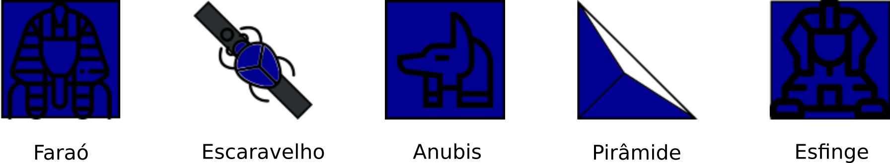

# Laser Chess

Um jogo em C++ utilizando Qt5

# Peças

# Regras

Azul se move primeiro. Os jogadores se alternam, com cada jogador movendo apenas suas próprias peças. Todas as peças, incluindo Faraós, podem ser movidas.

Cada jogador possui uma Esfinge que contém um laser. Não é uma peça de jogo e não pode ser eliminada do jogo. Ela está sempre localizada em seu canto especial. Em uma jogada, a Esfinge pode ser girada para apontar o laser sempre para dentro do tabuleiro. Esta rotação opcional da Esfinge é feita EM VEZ de mover uma peça de acordo com as regras a seguir.

Se o jogador decidir NÃO girar sua Esfinge, então: uma jogada consiste em mover qualquer peça para uma casa em qualquer direção (inclusive diagonalmente) OU girar uma peça 90 graus em qualquer direção. Para girar em sentido horário aperte a tecla (->) ou (<-) para girar em sentido anti-horário.

Nenhuma peça vermelha pode se mover para qualquer casa azul. Como também, nenhuma peça azul pode se mover para qualquer casa vermelha.

Exceto o Escaravelho, nenhuma peça pode se mover para um quadrado ocupado por outra peça. O Escaravelho pode trocar de lugar com uma Pirâmide ou Anúbis adjacente, mas não com um Faraó ou outro Escaravelho.

Depois da jogada, a Esfinge do jogador da vez irá acionar o laser. Se o laser atingir uma superfície não espelhada de uma pirâmide, essa peça será removida do tabuleiro.

O Anubis irá absorver o laser se o atingir pela frente, e a peça não será destruída. Caso contrário, a peça será removida do jogo.

O jogo termina se o laser atingir algum dos Faraós.
